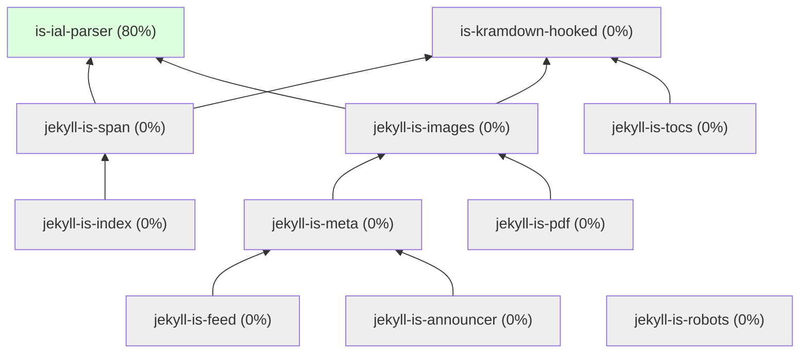

# Jekyll IS — Экосистема расширений 

> **Модульные плагины для Jekyll.**  
> Один AST. HTML + LaTeX. Без компромиссов.

## Схема зависимостей и состояние

---

**Автор**: [Ivan Shikhalev](https://github.com/shikhalev)  
