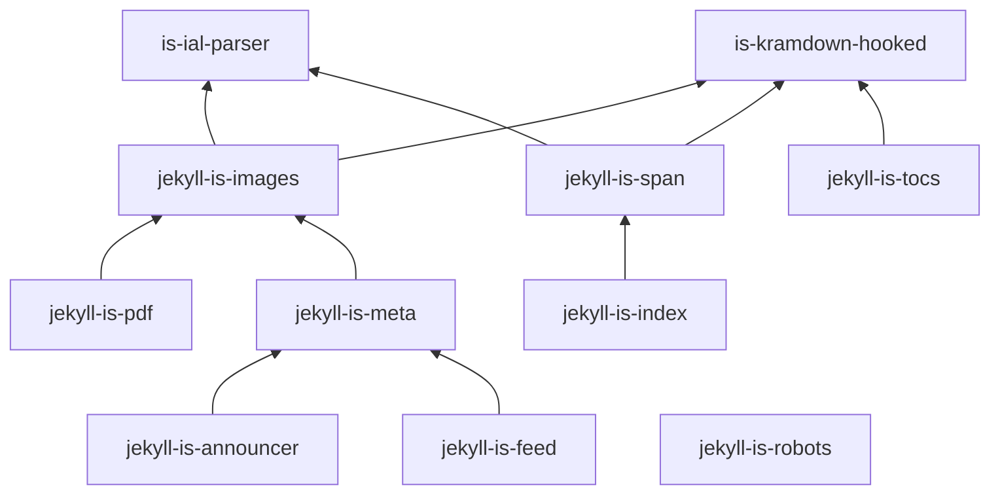

# Jekyll IS — Экосистема расширений 

> **Модульные плагины для Jekyll.**  
> Один AST. HTML + LaTeX. Без компромиссов.

---

## Что уже есть

| Репозиторий | Описание |
|------------|---------|
| [`jekyll-is-ecosystem`](.) | Этот репозиторий — документация, архитектура, примеры |

> Остальные плагины — **в разработке**.

---

## Планы (Roadmap)

| Этап | Репозитории | Статус |
|------|------------|--------|
| 1 | `is-ial-parser` | Планируется |
| 2 | `jekyll-is-span` | Планируется |
| 3 | `jekyll-is-figure` | Планируется |
| 4 | `jekyll-is-pdf-book` | Планируется |

[Подробнее → `ROADMAP.md`](ROADMAP.md)

---

## Архитектура (будущая)

[Подробнее → `ARCHITECTURE.md`](ARCHITECTURE.md)

---

**Автор**: [Ivan Shikhalev](https://github.com/shikhalev)  
**Лицензия**: [MIT](LICENSE)
